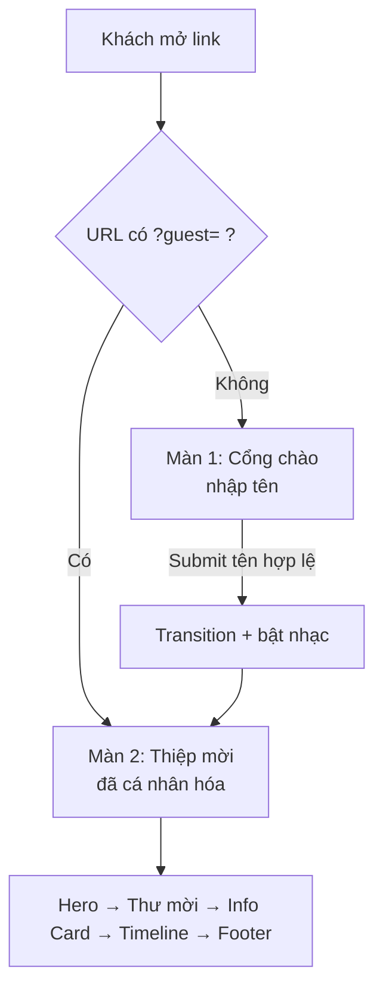

# SPEC — Thiệp mời tốt nghiệp · Dawn (Đức)

> Phiên bản: **0.2** · Ngày: 2026-09-15 · Trạng thái: chờ chốt 2 mục cuối (mục 9)
> Thay đổi từ v0.1: chốt ngày giờ, chốt naming Đức/Dawn, **đổi palette** theo ảnh chân dung thật, thêm nhạc nền, thêm quy trình deploy Vercel.

---

## 1. Mục tiêu

Web tĩnh 2 màn hình, đóng vai trò **thiệp mời điện tử cá nhân hóa** cho lễ tốt nghiệp.
Khách mở link → nhập tên → thiệp mở ra với tên của chính họ trong nội dung thư.

Ảnh design tham chiếu (portfolio template) chỉ dùng làm **ngôn ngữ thị giác**: layout asymmetric, khoảng trắng rộng, heading bold cỡ lớn, label uppercase tracking rộng, card accent đè lệch lên ảnh. Không copy nội dung.

### Ngoài phạm vi
- Không backend, không database.
- **Không RSVP** (đã chốt — khách không xác nhận tham dự trên web).
- Không đa ngôn ngữ (chỉ Tiếng Việt).

---

## 2. Naming — Đức vs Dawn

Hai tên dùng ở hai lớp khác nhau, **không trộn lẫn**:

| Ngữ cảnh | Dùng tên | Ví dụ |
|---|---|---|
| Wordmark / hero / footer (lớp thương hiệu) | **Dawn** | `Hello, I'm Dawn` · `Dawn • 2026` |
| Nội dung thư, lời mời Tiếng Việt (lớp thân mật) | **Đức** | `Đức rất vui và vinh dự được mời...` |
| `<title>`, OG meta | Cả hai | `Thiệp mời tốt nghiệp — Dawn (Đức)` |

Lý do: `Dawn` giữ được nhịp thị giác của design gốc (`Hello I'm John Doe`), `Đức` giữ được giọng văn thật trong thư.

---

## 3. Luồng



**Quy tắc state:**
- Tên lưu ở `sessionStorage` + push vào URL qua `history.replaceState` dạng `?guest=<encodeURIComponent(name)>`.
- Vào link đã có `?guest=` → **bỏ qua Màn 1**. Cơ chế này để gửi link riêng cho từng người mà họ không phải gõ tên.
- Link `Không phải bạn? Nhập lại tên` ở footer → xoá state, quay Màn 1.

---

## 4. Màn 1 — Cổng chào (Entry Gate)

| Thành phần | Nội dung |
|---|---|
| Eyebrow | `LỜI MỜI THAM DỰ` |
| Heading | `Bạn nhận được một lời mời từ Đức` |
| Sub | `Nhập tên của bạn để mở thiệp nhé.` |
| Input | placeholder `Tên của bạn...` |
| Button | `Mở thiệp mời` |

### Hành vi
- Full viewport `100dvh`, căn giữa. Nền: `portrait.jpg` phóng to + `filter: blur(24px) brightness(.45)` + overlay `--c-wine` — tận dụng luôn tông đỏ rượu của ảnh làm nền cổng chào.
- `<form>` thật → Enter hoặc click đều submit.
- **Validation**: `trim()` không rỗng, 1–40 ký tự. Rỗng → shake input + `Đức cần biết tên bạn để ghi lên thiệp 🙂`
- **Sanitize**: tên chỉ render qua `textContent`, **không bao giờ** `innerHTML`. Bắt buộc — `?guest=` là URL param, dùng innerHTML là dính XSS.
- Chuẩn hóa: trim + collapse whitespace. **Giữ nguyên hoa/thường người dùng nhập** (auto title-case dễ sai với tên Việt).

### Transition
- Màn 1 `opacity→0` + `translateY(-16px)` 450ms ease-out; Màn 2 fade-in + slide-up 600ms, stagger 80ms/khối.
- `prefers-reduced-motion: reduce` → cắt animation, chuyển tức thì.

---

## 5. Màn 2 — Thiệp mời

### 5.1 Hero
- Desktop: 2 cột — trái text, phải `portrait.jpg` full-bleed sát mép phải (đúng ảnh tham chiếu).
- Mobile: 1 cột, ảnh trên, text dưới.
- Lời chào: `Chào {Tên},` — tên in đậm, cỡ lớn hơn, màu `--c-gold`.
- Heading: `Chào mừng đến với lễ tốt nghiệp của Đức`
- Subtitle: `Một chặng đường đã khép lại để mở ra những hành trình mới.`
- Scroll indicator mũi tên xuống, bounce nhẹ, click → `scrollIntoView({behavior:'smooth'})`.

### 5.2 Thư mời
> Đức rất vui và vinh dự được mời **{Tên}** đến tham dự lễ trao bằng tốt nghiệp đại học của mình.
> Sự hiện diện của **{Tên}** là niềm hạnh phúc và sự động viên to lớn đối với Đức.

Kết bằng chữ ký script `Dawn` (font `Dancing Script`, hoặc SVG chữ ký nếu bạn gửi ảnh).

### 5.3 Info Card
Card nền `--c-wine`, chữ kem, đè lệch lên ảnh (overlap) đúng style ảnh tham chiếu.

| Field | Giá trị |
|---|---|
| THỜI GIAN | **10:00 — Thứ Bảy, 26/09/2026** |
| ĐỊA ĐIỂM | `{{TBD}}` — chờ mục 9.1 |
| ĐỊA CHỈ | `{{TBD}}` — chờ mục 9.1 |

- Nút `Chỉ đường` → `https://www.google.com/maps/dir/?api=1&destination=<encoded>`, `target="_blank" rel="noopener"`.
- Bản đồ nhúng `<iframe loading="lazy">`, `aspect-ratio: 16/10`, bo góc. Không có API key → fallback link tĩnh, không nhúng.
- Nút `Thêm vào lịch` → sinh `.ics` client-side (`DTSTART:20260926T100000`, timezone `Asia/Ho_Chi_Minh`).

### 5.4 Timeline
Timeline dọc — giờ bên trái (uppercase, nhỏ, `letter-spacing: .18em`), mô tả bên phải.

| Giờ | Nội dung |
|---|---|
| 08:00 | Đón khách & Chụp ảnh check-in |
| 09:00 | Lễ trao bằng chính thức |
| 11:30 | Tiệc nhẹ / Ăn trưa cùng gia đình & bạn bè |

> ⚠️ Giờ lễ chính trong timeline (09:00) đang **lệch** với giờ bạn chốt ở Info Card (10:00). Xem mục 9.2.

- Mỗi item fade-in khi vào viewport (`IntersectionObserver`, `threshold: .2`, chạy 1 lần).

### 5.5 Footer
- `Thân mời, {Tên}. Hẹn gặp bạn!`
- `Dawn • 2026`
- Link nhỏ: `Không phải bạn? Nhập lại tên`

---

## 6. Nhạc nền

Trình duyệt **chặn autoplay có tiếng** khi chưa có user gesture. Giải pháp:

- Nhạc **không** phát ở Màn 1. Phát ngay tại `click` nút `Mở thiệp mời` — cú click đó chính là user gesture hợp lệ, nên `audio.play()` chắc chắn được cho phép.
- Nút toggle 🔊/🔇 cố định góc dưới-phải (`position: fixed`), luôn nhìn thấy ở Màn 2, `aria-label` rõ ràng.
- Trạng thái bật/tắt lưu `localStorage` → reload không bị bật lại ngoài ý muốn.
- `<audio loop preload="none">`, volume mặc định `0.35`, fade-in 1.5s để không giật mình.
- Bọc `.play()` trong `.catch()` — nếu trình duyệt vẫn chặn thì im lặng bỏ qua, không văng lỗi.
- File: `assets/audio/bgm.mp3` — **chưa có, xem mục 9.3**.

---

## 7. Design system

> **Đổi so với v0.1.** Palette hồng phấn của template gốc chửi nhau với ảnh chân dung (nền đỏ rượu, vest đen, polo xanh rêu). Palette dưới đây rút trực tiếp từ ảnh thật → thiệp và ảnh trông như một bộ.

```css
:root {
  --c-bg:      #FBF8F4;  /* kem ngà - nền chính */
  --c-bg-alt:  #F2EDE6;  /* section xen kẽ, footer */
  --c-wine:    #6E1420;  /* đỏ rượu - lấy từ nền ảnh. Card, button */
  --c-wine-dk: #4A0D16;  /* hover, gradient */
  --c-forest:  #1F3D32;  /* xanh rêu - lấy từ áo polo. Accent phụ */
  --c-gold:    #B08D3F;  /* nhấn tên khách, đường kẻ mảnh */
  --c-ink:     #241F1D;  /* heading */
  --c-body:    #5A524E;  /* body text */
  --c-line:    #E3DCD2;
  --c-on-wine: #F6ECE3;  /* chữ trên nền wine */

  --font-display: "Playfair Display", Georgia, serif;  /* heading - serif hợp tông lễ */
  --font-body:    "Be Vietnam Pro", system-ui, sans-serif; /* dựng riêng cho tiếng Việt */
  --font-script:  "Dancing Script", cursive;

  --step-hero: clamp(2.5rem, 7vw, 4.5rem);
  --step-h2:   clamp(1.9rem, 4vw, 3rem);
  --step-body: clamp(.95rem, 1.1vw, 1.05rem);

  --space-section: clamp(4rem, 10vw, 8rem);
  --radius: 4px;
  --maxw: 1100px;
}
```

**Vì sao đổi font so với v0.1:** template gốc dùng geometric sans (Poppins) cho vibe portfolio hiện đại. Thiệp mời tốt nghiệp nghiêng về trang trọng → `Playfair Display` cho heading. Body dùng `Be Vietnam Pro` vì nó dựng riêng cho dấu tiếng Việt, không bị vỡ dấu như Inter/Poppins ở các chữ như `Ữ`, `Ặ`.

- Heading: bold, tracking hơi âm, màu `--c-ink`.
- Eyebrow/label: uppercase, `.7rem`, `letter-spacing: .18em`, màu `--c-gold`.
- Body: `line-height: 1.75`, đo chữ tối đa `65ch`.
- **Dark mode: không hỗ trợ** — thiệp cố định 1 look sáng.

---

## 8. Kỹ thuật

| Hạng mục | Quyết định |
|---|---|
| Stack | HTML + CSS + vanilla JS. Không framework, không bundler. |
| Lý do | 2 màn, 1 state duy nhất (`guestName`). React/Next là thừa cân. |
| Font | Google Fonts, `preconnect` + `display=swap` |
| Ảnh | Convert `portrait.jpg` → `.webp` (giữ `.jpg` fallback qua `<picture>`), set `width`/`height` chống CLS |
| Audio | `.mp3`, `preload="none"`, ≤ 3MB |
| Trình duyệt | 2 bản gần nhất Chrome/Safari/Firefox + iOS Safari |

### Cấu trúc file
```
grad-letters/
├── index.html
├── SPEC.md
├── .gitignore          # .DS_Store, node_modules
├── vercel.json         # optional - cache headers
└── assets/
    ├── css/style.css
    ├── js/app.js
    ├── img/portrait.jpg  ✅ đã có
    └── audio/bgm.mp3     ⏳ chờ file
```

### Deploy — Vercel qua GitHub
1. `git init` + commit (⚠️ **xin xác nhận trước khi chạy lệnh git** — theo rule).
2. Tạo repo GitHub (`gh repo create grad-letters --private --source=.`).
3. Vercel → Import Git Repository → framework preset **Other** → không build command, output = root.
4. Domain: dùng `*.vercel.app` mặc định, hoặc gắn domain riêng nếu bạn có.
5. Quét secret trong diff trước khi push (theo rule cá nhân).

### Tiêu chí chấp nhận
1. Link sạch → thấy Màn 1. Màn 2 `hidden` mặc định kể cả khi JS chậm/lỗi.
2. Nhập `Minh Anh` → tên hiện đúng **4 chỗ**: hero, thư ×2, footer.
3. URL đổi thành `?guest=Minh%20Anh`; reload → vào thẳng Màn 2.
4. Nhập `` → hiện nguyên văn dạng text, **không** thực thi.
5. Nhạc chỉ phát sau khi bấm `Mở thiệp mời`, toggle tắt/bật hoạt động, reload nhớ trạng thái.
6. 375px không có scroll ngang.
7. Bật "Giảm chuyển động" → không animation, nội dung vẫn đầy đủ.
8. Lighthouse: Performance ≥ 90, Accessibility ≥ 95.

---

## 9. Còn thiếu để code xong 100%

| # | Mục | Ảnh hưởng | Mặc định nếu bỏ qua |
|---|---|---|---|
| 9.1 | **Địa điểm + địa chỉ** (tên trường / hội trường / tầng–phòng) | Info Card + nút Chỉ đường + iframe map | Render `{{TBD}}`, ẩn nút Chỉ đường |
| 9.2 | **Giờ lễ chính**: Info Card ghi 10:00 nhưng timeline mẫu ghi 09:00 | Mâu thuẫn hiển thị trên chính thiệp | Đẩy timeline thành 08:30 đón khách / **10:00 lễ chính** / 11:30 tiệc |
| 9.3 | **File nhạc** `.mp3` | Mục 6 không chạy được | Code sẵn toàn bộ logic + nút toggle, chỉ thiếu file → thả vào `assets/audio/bgm.mp3` là chạy |

→ Thiếu cả 3 vẫn code được toàn bộ; chỉ cần điền giá trị vào `CONFIG` object đầu `app.js` sau.
